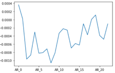
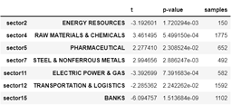
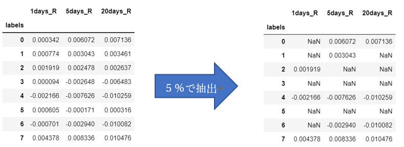
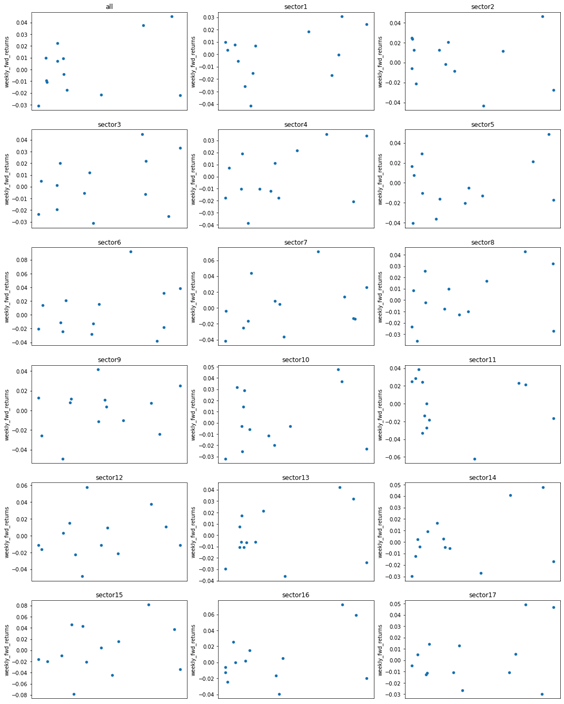
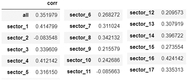

# J-Quants_MySubmission
<a href="https://signate.jp/competitions/443">日本取引所グループ ニュース分析チャレンジ</a>で8位に入賞しましたので、コードを公開します。  
こちらのページは、入賞者査定の際にSIGNATE事務局へ提出したファイル・コードになります。  
尚、本コンペティションで利用データしたデータは削除しました。  
また、BERTモデルはファイル容量の都合上、掲載しておりません。  

以下は、事務局あてに送った各コードの概要の転記になります。  
内容について気になること等ありましたらお気軽にお問い合わせください。  

## はじめに
提出したポートフォリオ予測モデルの概要を説明します。  
今回提出したモデルによるポートフォリオ組成の手順は、以下のような流れとなっております。  
①&nbsp;直近の1週間のニュースを取得し、BERT特徴量に変換  
②&nbsp;①の特徴量をクラスタリングし、クラスター7の銘柄に絞る  
③&nbsp;業種区分によるスクリーニングをする  
④&nbsp;特別損失銘柄は除外する  
⑤&nbsp;LSTMモデルにより投資対象銘柄群全体と各業界のセンチメントスコアを算出  
※各スコアは学習期間のパラメータ(平均, 標準偏差)に基づき基準化したものとする  
⑥&nbsp;⑤のユニバースに対するスコアから現金比率を決定する  
⑦&nbsp;⑤の各業種のセンチメントスコアからセクターへの投資比率を決定する  
⑧&nbsp;各セクターの銘柄選定は、直近のニュースがあるものを優先する  

上記のポートフォリオ組成戦略導出に関する分析や利用したモデルの学習等については、次に紹介するJupyter Notebook(「./ipunb」)をご参照ください。  
最終的に提出したソースコードは、Jupyter NoteをベースにPythonスクリプトに書き換えたものとなっております。
本コンペで提出用したものは「./archive」をzip化したものとなっております。  

## Jupter Notebookについて
### 0. 準備  
* get_recent_news_data.ipynb  
今回提出したモデルは、ニュース記事のみからシグナルを出すものとなっております。  
事前提供ファイルでは2020年末までしかなかったため、本プログラムでAPIを利用し、2021年3月31日までのニュースデータを取得しました。  
また、取得したデータはGoogleColaboratoryでBERTを用いて分散表現に変換しております。  

* Analysis_Text_data.ipynb  
モデル構築に向け、ニュース記事とリターンの関係について分析しております。  
今回のモデルと関係があるのは、イベントスタディ分析の箇所になります。  
分析の結果、「公表直後は異常リターンが見られ、20日前後で異常リターンは無くなる」傾向がありました。  
全体の平均は負のリターンですが、直近のニュースの方がリターンを得られる可能性が高いと判断しました。  
その結果、モデルでは直近5日分のニュースをインプット対象としました。  
  
※取引時間は9:00～15:00である為、リターン算出時の終値とニュースを関連付けは注意するように配慮しました。したがって、15:00以降に公表されたニュースは翌日の終値と関連付けております。  

* Analysis_Sector.ipynb  
グループ間(17業種区分 / クラスタリング)によりリターンの差がないか分析しました。  
リターンに差があれば、高リターン群の銘柄を採用し、低リターン群の銘柄は除外することでポートフォリオ全体のリターン向上を期待しました。  
まず、業種別では、ニュース公表後のリターンに差が見られました(下図)。  
   
したがって、ポートフォリオ組成時は負のリターンとなりやすいSector 2, 11, 12, 15は除外するようにしました。  
次にクラスター間の分析では、BERT特徴量をクラスタリングして各クラスターのリターンの差について見てみました。  
尚、モデル提出時のクラスタリングモデルはこの時点で学習させたものを利用しております。  
各クラスターのリターンを算出した結果、クラスター4で負のリターン,クラスター7で正のリターンで得られる可能性が高いことがわかりました(有意水準5%)。  
   
両クラスターに関してwordcloudを用いて単語の特徴を見た結果、クラスター4にはネガティブな単語が多く、クラスター7にはポジティブな単語が多く分布する傾向があることがわかりました。  
クラスター7のデータ数はある程度確保できていたので、<u>クラスター7の銘柄に絞って投資する戦略</u>としました。  
   

* BERTのダウンロード事前学習済みモデルのダウンロード.ipynb  
コンペ提出用のBERTモデルのダウンロードをするために利用しました。

### 1. 前処理  
* LSTM_Sector.ipynb(前半)  
BERT特徴量、株価、セクター情報をもとにデータセットを作成しました。  
尚、事前提供データは2020年分までだったので、2021年3月31日までを別途APIで取得したものを結合しております。  
前処理の手順はチュートリアルを参考にさせていただいたのでほぼ同じです。  
主な違いは、投資対象全銘柄(ユニバース)と各セクターの市場リターンの18次元の符号ベクトルをラベルに利用している点です。  
特徴量(入力データ)作成は、build_weekly_features(features, boundary_week)を利用しております。  
ラベルの作成は、build_weekly_labels(stock_price, boundary_week)をユニバース銘柄群と各セクター銘柄群に適用し、結合して18次元のベクトルとしております。(ノートブックだと『特徴量合成モデルの学習及び特徴量合成』が該当します。)  

### 2. 学習
* Analysis_Sector.ipynb  
クラスタリングモデルを構築しております。内容は「0.準備」で記載した通りです。ノートブックの『検証②』の中でモデル作成と保存をしております。シードは、”0”に設定し、その他パラメータはデフォルトのままです。構築したモデルは、「./model/ kmeans_model.pickle」になります。  

* LSTM_Sector.ipynb(後半)  
LSTMモデルを構築しております。  
モデルの学習は、feature_combiner_ handler.train(n_epoch=20)で実行し、「./archive/model/headline_features/」に作成したものを格納おります。  
”LSTM_sentiment.pkl”がモデル構造、“9.ckpt”が利用した重みです。  
重みは、学習データに対する損失値が最小のものを利用しました。   
※補足※  
LSTMではシードの固定をしておりません。  
何度かモデルの学習を行い、モデルの予測値に関して検証をしていく中で、初期値(乱数)によっては粗悪なモデルとなることもわかりました。  
提出させていただいくノートブックとモデルは、それらの中でも比較的うまく学習できたものとなっております。  
このモデルの良し悪しの判断は、モデルの予測値(センチメントスコア)とリターンの相関が正&数値が高い(チュートリアルの値に近い)ことを確認することで行いました。  
本来であれば、センチメントと各インデックスとのリターンは正の相関になることが好ましいです。  
しかし、モデルの検証において負の相関となることもありました。
2値分類なのでこのようなことが起きるのは仕方がないのかもしれません。  
提出したものは、全体的に相関が正で高かったものとなっております。  

  
  

 

### 3. 予測(ポートフォリオ予測)
* Trading_Strategy.ipynb  
上記0.~2.を踏まえて、ポートフォリオ予測戦略に関してまとめたものとなっております。  

* BackTest.ipynb
ポートフォリオ予測に関してバックテストを行うために利用しました。  

 

## ご参考

個人ブログに本コンペのモデル構築の一連の流れを掲載しております。  
---------第1回---------  
タイトル：<a href="https://www.systrenote.com/signate_jpx_news/">【SIGNATE】JPX ニュース分析:ニュースに関するEDA</a>  
記事内容：  
ニュースの写真の有無のリターンへの影響、記事の文字数のリターンの影響、ニュースそのものが株価に影響を与えているか(イベントスタディ分析)  

---------第2回---------  
タイトル：<a href="https://www.systrenote.com/signate_jpx_news_2/">【SIGNATE】JPX ニュース分析:ニュースに基づく個別銘柄の予測</a>  
記事内容：  
個別銘柄のBERT特徴量から株価を予測する簡単なモデルを構築  

---------第3回---------  
タイトル：<a href="https://www.systrenote.com/signate_jpx_news_3/">【SIGNATE】JPX ニュース分析:ニュースに基づく各業種の分析</a>  
記事内容：  
業種区分やクラスタリングのグループとリターンの関係について分析  

---------第4回---------  
タイトル：<a href="https://www.systrenote.com/signate_jpx_news_4/">【SIGNATE】JPX ニュース分析:ポートフォリオ組成戦略と提出</a>  
記事内容：  
第3回までの結果を踏まえたニュース記事のみに基づくポートフォリオ組成とコンペへの投稿  

---------------------------  

